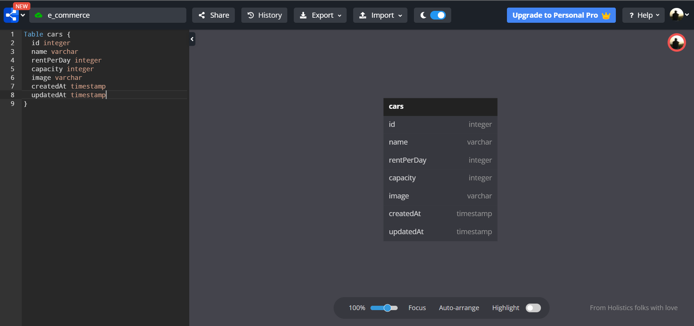

# Cars Management API

### Diagram

### Endpoint

##### METHOD GET :

- '/api/cars' - get all cars
- '/api/cars/[id]' - get a car based on **id**

##### METHOD POST :

- '/api/cars' - insert a car

##### METHOD PUT :

- '/api/cars/[id]' - update full car object based on **id**

##### METHOD PATCH :

- '/api/cars/[id]' - update partial car object based on **id**

##### METHOD DELETE :

- '/api/cars/[id]' - delete car object based on **id**

#

### Database

##### Cars Attributes

- name:varchar
- rentPerDay: integer
- capacity: integer
- image: varchar
